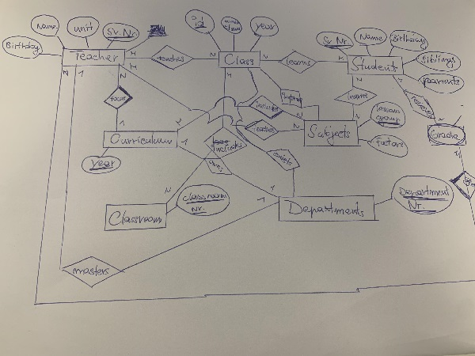

# SchoolERM
A school information system for an HTL is to be developed:
The departmental structure of an HTL is to be reproduced. Each teacher is assigned to a department as a master department, but can also teach in classes of other departments. Each department is headed by a teacher as head of department.
For each form of education of the departments, the curriculum specifies which subjects have to be taught in which year and to what extent (theory and practice lessons).
The classes of a school year are taught by the teachers in the individual subjects to a certain extent (theory and practice lessons). Each student is assessed with one semester and one year mark per class and subject. The system should be able to record this information for several school years.
It should be possible to find out the class leaders of the different classes, as well as by whom which functions (class representative, cashier, etc.) are or were exercised.
Teachers are not remunerated according to the number of hours they teach, but according to the value units they hold: Each subject is assigned to a specific compulsory teaching group (I to VI). A factor (1.167 to 0.75) is defined for each teaching obligation group, which is used to convert lessons into value units.
A parent is responsible for each pupil (unless the pupil is a self-entitled guardian). If siblings attend school, this should also be able to be determined.

## Text notification

Teacher (Sv Nr. : int, Unit: int, Name: varchar, Birthday: date)   
Class (ID: int, Number of Students: int, Year: date)  
Students (Sv Nr. : int, Name: varchar, Birthday: date, Siblings: boolean, Parents: boolean)  
Curriculum (Year: date)  
Subjects (Lessons Group: int, Factors: double,)  
Classroom (Classroom Nr. : int)  
Departments (Department Nr. : int)

 

Class -> (Class Id, Teacher_Sv.Nr., Student_Sv.Nr., Classroom Nr., Departments Nr., Subjects) 

Curriculum -> (Curriculum year, Class Id, Lessons group,)

Teacher -> (Sv. Nr., Name, Birthday, Unit)

Student -> (Class Id, Sv. Nr. )

Student Family -> (Sv. Nr. Siblings_Id, Parents_Id )

Grades -> (Class Id. Students. Id, Lessons group, Subjects)

Departments -> (Headmaster_Teacher Id., Department Nr.)

Classrom -> (Classrom Nr. , Subjects)

Subjects -> (Subjects Name, Subjects Id., Teacher)

Teacher_teaches_Class :  
Class Id  
Sv Nr. 

Students_learns_Class :  
Class Id.  
Sv Nr.

Teacher_focus_Curriculum :  
Sv Nr.  
year

Teacher_teaches_Subjects :  
Sv Nr.  
Lessons group

Students_learns_Subjects :  
Sv Nr.  
Lessons Group

CLass_includes_Classroom :  
Class Id.  
Classroom Nr.

